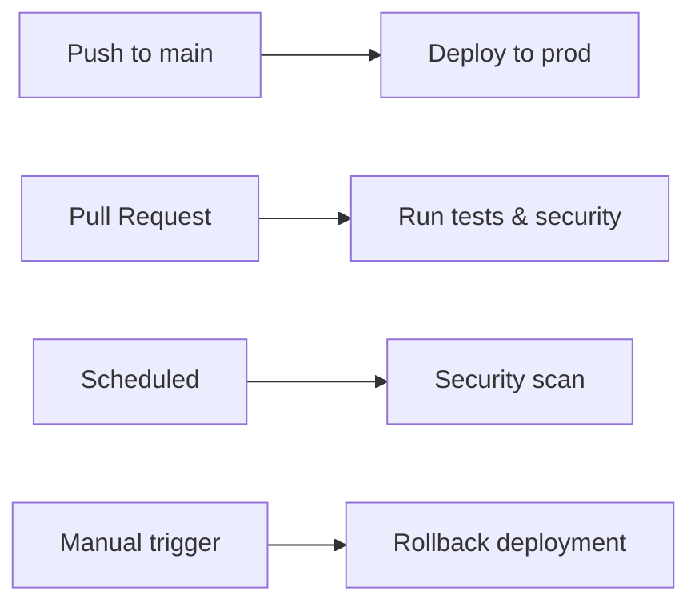
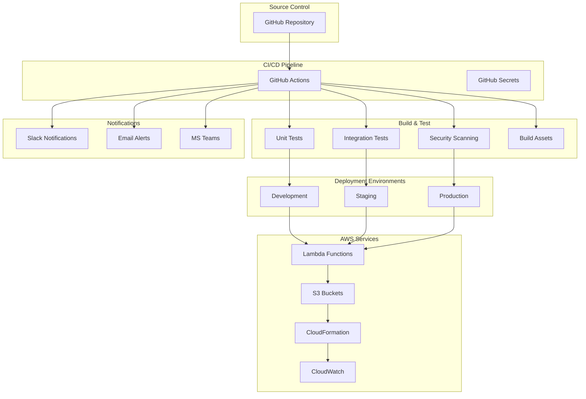

# 🤖 CI/CD Pipeline Documentation

> **Purpose**: Complete Continuous Integration and Continuous Deployment setup using GitHub Actions. This guide covers automated testing, security scanning, building, and deployment to AWS.

## 📋 Table of Contents

- [🎯 Pipeline Overview](#-pipeline-overview)
- [🏗️ Pipeline Architecture](#️-pipeline-architecture)
- [🚀 Main Deployment Pipeline](#-main-deployment-pipeline)
- [🧪 Testing Pipeline](#-testing-pipeline)
- [🔒 Security Pipeline](#-security-pipeline)
- [📦 Build & Package Pipeline](#-build--package-pipeline)
- [🌍 Environment-Specific Deployments](#-environment-specific-deployments)
- [🔄 Rollback Strategies](#-rollback-strategies)
- [📊 Pipeline Monitoring](#-pipeline-monitoring)
- [🛠️ Troubleshooting](#️-troubleshooting)

---

## 🎯 Pipeline Overview

Our CI/CD pipeline provides:

1. **Automated Testing**: Unit, integration, and end-to-end tests
2. **Security Scanning**: Code analysis, dependency checks, secrets detection
3. **Multi-Environment Deployment**: Development, staging, and production
4. **Rollback Capabilities**: Quick rollback to previous versions
5. **Monitoring Integration**: Deployment notifications and health checks

### Pipeline Triggers



---

## 🏗️ Pipeline Architecture



---

## 🚀 Main Deployment Pipeline

### Main Workflow (.github/workflows/deploy.yml)

```yaml
name: 🚀 Deploy Multitask Platform

on:
  push:
    branches: [main, develop]
  pull_request:
    branches: [main]
  workflow_dispatch:  # Manual trigger
    inputs:
      environment:
        description: 'Environment to deploy to'
        required: true
        default: 'dev'
        type: choice
        options:
          - dev
          - staging
          - prod
      rollback_version:
        description: 'Version to rollback to (optional)'
        required: false
        type: string

env:
  AWS_REGION: us-east-1
  GO_VERSION: '1.22'
  NODE_VERSION: '18'

jobs:
  # Job 1: Code Quality & Security
  quality-check:
    name: 🔍 Quality & Security Check
    runs-on: ubuntu-latest
    outputs:
      should-deploy: ${{ steps.changes.outputs.should-deploy }}
    
    steps:
      - name: 📥 Checkout code
        uses: actions/checkout@v4
        with:
          fetch-depth: 0  # Full history for better analysis

      - name: 🔍 Detect changes
        id: changes
        uses: dorny/paths-filter@v2
        with:
          filters: |
            services:
              - 'services/**'
            frontend:
              - 'apps/web/**'
            infra:
              - 'infra/**'
            should-deploy:
              - 'services/**'
              - 'apps/web/**'
              - 'infra/**'

      - name: 🛡️ Security scan
        if: steps.changes.outputs.should-deploy == 'true'
        uses: securecodewarrior/github-action-add-sarif@v1
        with:
          sarif-file: 'security-scan-results.sarif'

      - name: 📊 SonarCloud analysis
        if: steps.changes.outputs.should-deploy == 'true'
        uses: SonarSource/sonarcloud-github-action@master
        env:
          GITHUB_TOKEN: ${{ secrets.GITHUB_TOKEN }}
          SONAR_TOKEN: ${{ secrets.SONAR_TOKEN }}

  # Job 2: Backend Testing
  test-backend:
    name: 🧪 Test Backend Services
    runs-on: ubuntu-latest
    needs: quality-check
    if: needs.quality-check.outputs.should-deploy == 'true'
    
    strategy:
      matrix:
        service: [auth-svc, profile-svc, chat-svc, post-svc, catalog-svc, ai-svc]
    
    steps:
      - name: 📥 Checkout code
        uses: actions/checkout@v4

      - name: 🐹 Setup Go
        uses: actions/setup-go@v4
        with:
          go-version: ${{ env.GO_VERSION }}

      - name: 📦 Cache Go modules
        uses: actions/cache@v3
        with:
          path: ~/go/pkg/mod
          key: ${{ runner.os }}-go-${{ hashFiles('**/go.sum') }}
          restore-keys: |
            ${{ runner.os }}-go-

      - name: 📥 Download dependencies
        working-directory: ./services/${{ matrix.service }}
        run: go mod download

      - name: 🧪 Run unit tests
        working-directory: ./services/${{ matrix.service }}
        run: |
          go test -v -race -coverprofile=coverage.out ./...
          go tool cover -html=coverage.out -o coverage.html

      - name: 📊 Upload coverage to Codecov
        uses: codecov/codecov-action@v3
        with:
          file: ./services/${{ matrix.service }}/coverage.out
          flags: ${{ matrix.service }}

      - name: 🏗️ Build service
        working-directory: ./services/${{ matrix.service }}
        run: |
          GOOS=linux GOARCH=amd64 go build -ldflags="-s -w" -o bin/${{ matrix.service }} cmd/lambda/main.go

      - name: 📦 Upload build artifacts
        uses: actions/upload-artifact@v3
        with:
          name: ${{ matrix.service }}-binary
          path: ./services/${{ matrix.service }}/bin/${{ matrix.service }}
          retention-days: 7

  # Job 3: Frontend Testing
  test-frontend:
    name: 🌐 Test Frontend
    runs-on: ubuntu-latest
    needs: quality-check
    if: needs.quality-check.outputs.should-deploy == 'true'
    
    steps:
      - name: 📥 Checkout code
        uses: actions/checkout@v4

      - name: 🟢 Setup Node.js
        uses: actions/setup-node@v4
        with:
          node-version: ${{ env.NODE_VERSION }}
          cache: 'npm'
          cache-dependency-path: apps/web/package-lock.json

      - name: 📦 Install dependencies
        working-directory: ./apps/web
        run: npm ci

      - name: 🔍 Lint code
        working-directory: ./apps/web
        run: npm run lint

      - name: 🧪 Run unit tests
        working-directory: ./apps/web
        run: npm run test:coverage

      - name: 🏗️ Build frontend
        working-directory: ./apps/web
        run: npm run build

      - name: 📦 Upload build artifacts
        uses: actions/upload-artifact@v3
        with:
          name: frontend-build
          path: ./apps/web/dist
          retention-days: 7

  # Job 4: Integration Tests
  integration-tests:
    name: 🔗 Integration Tests
    runs-on: ubuntu-latest
    needs: [test-backend, test-frontend]
    
    services:
      # Local DynamoDB for testing
      dynamodb:
        image: amazon/dynamodb-local:latest
        ports:
          - 8000:8000

      # Local Redis for testing
      redis:
        image: redis:7-alpine
        ports:
          - 6379:6379

    steps:
      - name: 📥 Checkout code
        uses: actions/checkout@v4

      - name: 🐹 Setup Go
        uses: actions/setup-go@v4
        with:
          go-version: ${{ env.GO_VERSION }}

      - name: 🟢 Setup Node.js
        uses: actions/setup-node@v4
        with:
          node-version: ${{ env.NODE_VERSION }}

      - name: 📥 Download backend artifacts
        uses: actions/download-artifact@v3
        with:
          path: ./artifacts/

      - name: 🧪 Run integration tests
        env:
          DYNAMODB_ENDPOINT: http://localhost:8000
          REDIS_ENDPOINT: localhost:6379
          TEST_MODE: integration
        run: |
          # Start services locally
          ./scripts/start-local-services.sh &
          
          # Wait for services to be ready
          sleep 30
          
          # Run integration tests
          go test -tags=integration ./tests/integration/...

  # Job 5: Deploy to Environment
  deploy:
    name: 🚀 Deploy to ${{ matrix.environment }}
    runs-on: ubuntu-latest
    needs: [integration-tests]
    if: always() && (needs.integration-tests.result == 'success')
    
    strategy:
      matrix:
        environment: 
          - ${{ github.ref == 'refs/heads/main' && 'prod' || 'dev' }}
    
    environment:
      name: ${{ matrix.environment }}
      url: ${{ steps.deploy.outputs.api-url }}

    steps:
      - name: 📥 Checkout code
        uses: actions/checkout@v4

      - name: 🔧 Configure AWS credentials
        uses: aws-actions/configure-aws-credentials@v4
        with:
          aws-access-key-id: ${{ secrets.AWS_ACCESS_KEY_ID }}
          aws-secret-access-key: ${{ secrets.AWS_SECRET_ACCESS_KEY }}
          aws-region: ${{ env.AWS_REGION }}

      - name: 🟢 Setup Node.js
        uses: actions/setup-node@v4
        with:
          node-version: ${{ env.NODE_VERSION }}

      - name: 📦 Install Serverless Framework
        run: npm install -g serverless

      - name: 📥 Download build artifacts
        uses: actions/download-artifact@v3
        with:
          path: ./artifacts/

      - name: 📋 Prepare deployment
        run: |
          # Copy built binaries to service directories
          for service in auth-svc profile-svc chat-svc post-svc catalog-svc ai-svc; do
            mkdir -p ./services/$service/bin/
            cp ./artifacts/${service}-binary/$service ./services/$service/bin/
            chmod +x ./services/$service/bin/$service
          done

      - name: 🚀 Deploy infrastructure
        id: deploy
        working-directory: ./infra
        run: |
          # Deploy using Serverless Framework
          serverless deploy --stage ${{ matrix.environment }} --verbose
          
          # Get API Gateway URL
          API_URL=$(serverless info --stage ${{ matrix.environment }} --verbose | grep 'endpoints:' -A 1 | grep 'https' | awk '{print $3}')
          echo "api-url=$API_URL" >> $GITHUB_OUTPUT

      - name: 🌐 Deploy frontend
        if: needs.test-frontend.result == 'success'
        run: |
          # Download frontend build
          aws s3 sync ./artifacts/frontend-build/ s3://multitask-frontend-${{ matrix.environment }}/ --delete
          
          # Invalidate CloudFront cache
          aws cloudfront create-invalidation \
            --distribution-id ${{ secrets[format('CLOUDFRONT_DISTRIBUTION_ID_{0}', upper(matrix.environment))] }} \
            --paths "/*"

      - name: 🧪 Post-deployment tests
        run: |
          # Wait for deployment to be ready
          sleep 60
          
          # Run smoke tests
          ./scripts/smoke-tests.sh ${{ steps.deploy.outputs.api-url }}

      - name: 📊 Update deployment status
        if: always()
        uses: actions/github-script@v6
        with:
          script: |
            const deployment = await github.rest.repos.createDeploymentStatus({
              owner: context.repo.owner,
              repo: context.repo.repo,
              deployment_id: context.payload.deployment?.id || 'unknown',
              state: '${{ job.status }}' === 'success' ? 'success' : 'failure',
              environment_url: '${{ steps.deploy.outputs.api-url }}',
              description: 'Deployment to ${{ matrix.environment }}'
            });

  # Job 6: Notifications
  notify:
    name: 📢 Send Notifications
    runs-on: ubuntu-latest
    needs: [deploy]
    if: always()
    
    steps:
      - name: 📢 Slack notification
        uses: 8398a7/action-slack@v3
        with:
          status: ${{ needs.deploy.result }}
          channel: '#deployments'
          webhook_url: ${{ secrets.SLACK_WEBHOOK }}
          fields: repo,message,commit,author,action,eventName,ref,workflow
        env:
          SLACK_WEBHOOK_URL: ${{ secrets.SLACK_WEBHOOK }}

      - name: 📧 Email notification
        if: failure()
        uses: dawidd6/action-send-mail@v3
        with:
          server_address: smtp.gmail.com
          server_port: 587
          username: ${{ secrets.EMAIL_USERNAME }}
          password: ${{ secrets.EMAIL_PASSWORD }}
          subject: '🚨 Deployment Failed: ${{ github.repository }}'
          body: |
            Deployment to ${{ matrix.environment }} failed.
            
            Commit: ${{ github.sha }}
            Author: ${{ github.actor }}
            Branch: ${{ github.ref }}
            
            Check the logs: ${{ github.server_url }}/${{ github.repository }}/actions/runs/${{ github.run_id }}
          to: devops@multitask.com
```

---

## 🧪 Testing Pipeline

### Dedicated Testing Workflow (.github/workflows/test.yml)

```yaml
name: 🧪 Test Suite

on:
  pull_request:
    branches: [main, develop]
  push:
    branches: [develop]
  schedule:
    - cron: '0 6 * * *'  # Daily at 6 AM UTC

jobs:
  # Unit Tests
  unit-tests:
    name: 🔬 Unit Tests
    runs-on: ubuntu-latest
    
    strategy:
      matrix:
        go-version: ['1.21', '1.22']
        service: [auth-svc, profile-svc, chat-svc, post-svc, catalog-svc, ai-svc]
    
    steps:
      - name: 📥 Checkout
        uses: actions/checkout@v4

      - name: 🐹 Setup Go ${{ matrix.go-version }}
        uses: actions/setup-go@v4
        with:
          go-version: ${{ matrix.go-version }}

      - name: 🧪 Run tests
        working-directory: ./services/${{ matrix.service }}
        run: |
          go test -v -race -coverprofile=coverage.out ./...
          go tool cover -func=coverage.out

  # Frontend Tests
  frontend-tests:
    name: 🌐 Frontend Tests
    runs-on: ubuntu-latest
    
    strategy:
      matrix:
        node-version: ['16', '18', '20']
    
    steps:
      - name: 📥 Checkout
        uses: actions/checkout@v4

      - name: 🟢 Setup Node.js ${{ matrix.node-version }}
        uses: actions/setup-node@v4
        with:
          node-version: ${{ matrix.node-version }}

      - name: 📦 Install dependencies
        working-directory: ./apps/web
        run: npm ci

      - name: 🧪 Run tests
        working-directory: ./apps/web
        run: |
          npm run test:unit
          npm run test:integration
          npm run test:e2e:headless

  # Load Testing
  load-tests:
    name: ⚡ Load Tests
    runs-on: ubuntu-latest
    if: github.event_name == 'schedule'
    
    steps:
      - name: 📥 Checkout
        uses: actions/checkout@v4

      - name: 🟢 Setup Node.js
        uses: actions/setup-node@v4
        with:
          node-version: '18'

      - name: 📦 Install Artillery
        run: npm install -g artillery

      - name: ⚡ Run load tests
        run: |
          artillery run tests/load/auth-load-test.yml
          artillery run tests/load/chat-load-test.yml
          artillery run tests/load/api-load-test.yml

      - name: 📊 Upload results
        uses: actions/upload-artifact@v3
        with:
          name: load-test-results
          path: ./test-results/
```

---

## 🔒 Security Pipeline

### Security Scanning Workflow (.github/workflows/security.yml)

```yaml
name: 🔒 Security Scanning

on:
  push:
    branches: [main, develop]
  pull_request:
    branches: [main]
  schedule:
    - cron: '0 2 * * 1'  # Weekly on Monday at 2 AM

jobs:
  # Code Security Analysis
  code-security:
    name: 🔍 Code Security Analysis
    runs-on: ubuntu-latest
    
    steps:
      - name: 📥 Checkout
        uses: actions/checkout@v4
        with:
          fetch-depth: 0

      - name: 🔒 Run CodeQL analysis
        uses: github/codeql-action/init@v2
        with:
          languages: go, javascript

      - name: 🏗️ Autobuild
        uses: github/codeql-action/autobuild@v2

      - name: 🔍 Perform CodeQL analysis
        uses: github/codeql-action/analyze@v2

  # Dependency Vulnerability Scan
  dependency-scan:
    name: 📦 Dependency Vulnerability Scan
    runs-on: ubuntu-latest
    
    steps:
      - name: 📥 Checkout
        uses: actions/checkout@v4

      - name: 🐹 Go dependency scan
        uses: securecodewarrior/github-action-nancy@v1
        with:
          path: ./services

      - name: 🟢 Node.js dependency scan
        uses: actions/setup-node@v4
        with:
          node-version: '18'

      - name: 📦 npm audit
        working-directory: ./apps/web
        run: |
          npm ci
          npm audit --audit-level high

  # Secrets Detection
  secrets-scan:
    name: 🔐 Secrets Detection
    runs-on: ubuntu-latest
    
    steps:
      - name: 📥 Checkout
        uses: actions/checkout@v4
        with:
          fetch-depth: 0

      - name: 🔐 Run GitLeaks
        uses: zricethezav/gitleaks-action@master
        env:
          GITHUB_TOKEN: ${{ secrets.GITHUB_TOKEN }}

  # Container Security (if using Docker)
  container-scan:
    name: 🐳 Container Security Scan
    runs-on: ubuntu-latest
    if: github.event_name == 'schedule'
    
    steps:
      - name: 📥 Checkout
        uses: actions/checkout@v4

      - name: 🐳 Build Docker image
        run: docker build -t multitask-platform:${{ github.sha }} .

      - name: 🔒 Run Trivy vulnerability scanner
        uses: aquasecurity/trivy-action@master
        with:
          image-ref: 'multitask-platform:${{ github.sha }}'
          format: 'sarif'
          output: 'trivy-results.sarif'

      - name: 📊 Upload Trivy scan results
        uses: github/codeql-action/upload-sarif@v2
        with:
          sarif_file: 'trivy-results.sarif'

  # Infrastructure Security
  infra-security:
    name: 🏗️ Infrastructure Security
    runs-on: ubuntu-latest
    
    steps:
      - name: 📥 Checkout
        uses: actions/checkout@v4

      - name: 🔒 Run Checkov
        uses: bridgecrewio/checkov-action@master
        with:
          directory: ./infra
          framework: serverless,terraform
          output_format: sarif
          output_file_path: checkov-results.sarif

      - name: 📊 Upload Checkov results
        uses: github/codeql-action/upload-sarif@v2
        with:
          sarif_file: checkov-results.sarif
```

---

## 📦 Build & Package Pipeline

### Build Optimization Workflow (.github/workflows/build.yml)

```yaml
name: 📦 Build & Package

on:
  workflow_call:
    inputs:
      environment:
        required: true
        type: string
    outputs:
      build-version:
        description: 'Build version number'
        value: ${{ jobs.build.outputs.version }}

jobs:
  build:
    name: 🏗️ Build Services
    runs-on: ubuntu-latest
    outputs:
      version: ${{ steps.version.outputs.version }}
    
    steps:
      - name: 📥 Checkout
        uses: actions/checkout@v4

      - name: 🏷️ Generate version
        id: version
        run: |
          VERSION=$(date +%Y%m%d)-${GITHUB_SHA:0:7}
          echo "version=$VERSION" >> $GITHUB_OUTPUT
          echo "🏷️ Build version: $VERSION"

      - name: 🐹 Setup Go
        uses: actions/setup-go@v4
        with:
          go-version: '1.22'

      - name: 🟢 Setup Node.js
        uses: actions/setup-node@v4
        with:
          node-version: '18'

      # Build Go services
      - name: 🏗️ Build Go services
        run: |
          for service in auth-svc profile-svc chat-svc post-svc catalog-svc ai-svc; do
            echo "🏗️ Building $service..."
            cd services/$service
            
            # Optimize binary size
            GOOS=linux GOARCH=amd64 CGO_ENABLED=0 go build \
              -ldflags="-s -w -X main.version=${{ steps.version.outputs.version }}" \
              -o bin/$service \
              cmd/lambda/main.go
            
            # Compress binary
            upx --best --lzma bin/$service
            
            cd ../..
          done

      # Build frontend
      - name: 🌐 Build frontend
        working-directory: ./apps/web
        run: |
          npm ci
          
          # Build with optimization
          NODE_ENV=production npm run build
          
          # Compress assets
          find dist -name "*.js" -exec gzip -9 -c {} \; > {}.gz
          find dist -name "*.css" -exec gzip -9 -c {} \; > {}.gz

      # Create deployment package
      - name: 📦 Create deployment package
        run: |
          mkdir -p deployment-package
          
          # Copy built services
          cp -r services/*/bin deployment-package/services/
          
          # Copy frontend build
          cp -r apps/web/dist deployment-package/frontend/
          
          # Copy infrastructure
          cp -r infra deployment-package/
          
          # Create archive
          tar -czf deployment-${{ steps.version.outputs.version }}.tar.gz deployment-package/

      - name: 📤 Upload deployment package
        uses: actions/upload-artifact@v3
        with:
          name: deployment-package-${{ steps.version.outputs.version }}
          path: deployment-${{ steps.version.outputs.version }}.tar.gz
          retention-days: 30

  # Multi-arch builds for future container support
  multi-arch-build:
    name: 🏗️ Multi-arch Build
    runs-on: ubuntu-latest
    if: github.ref == 'refs/heads/main'
    
    strategy:
      matrix:
        arch: [amd64, arm64]
    
    steps:
      - name: 📥 Checkout
        uses: actions/checkout@v4

      - name: 🐹 Setup Go
        uses: actions/setup-go@v4
        with:
          go-version: '1.22'

      - name: 🏗️ Build for ${{ matrix.arch }}
        run: |
          for service in auth-svc profile-svc chat-svc post-svc catalog-svc ai-svc; do
            GOOS=linux GOARCH=${{ matrix.arch }} CGO_ENABLED=0 go build \
              -ldflags="-s -w" \
              -o services/$service/bin/$service-${{ matrix.arch }} \
              services/$service/cmd/lambda/main.go
          done

      - name: 📤 Upload binaries
        uses: actions/upload-artifact@v3
        with:
          name: binaries-${{ matrix.arch }}
          path: services/*/bin/*-${{ matrix.arch }}
```

---

## 🌍 Environment-Specific Deployments

### Environment Configuration

```yaml
# .github/environments/dev.yml
environment:
  name: development
  url: https://api-dev.multitask.com
  protection_rules:
    - type: required_reviewers
      required_reviewers: 1

# .github/environments/staging.yml  
environment:
  name: staging
  url: https://api-staging.multitask.com
  protection_rules:
    - type: required_reviewers
      required_reviewers: 2
    - type: wait_timer
      wait_timer: 5  # 5 minutes

# .github/environments/prod.yml
environment:
  name: production
  url: https://api.multitask.com
  protection_rules:
    - type: required_reviewers
      required_reviewers: 3
    - type: wait_timer
      wait_timer: 30  # 30 minutes
```

### Environment-Specific Secrets

```bash
# Development secrets
CLOUDFRONT_DISTRIBUTION_ID_DEV
RDS_PASSWORD_DEV
JWT_SECRET_DEV

# Staging secrets  
CLOUDFRONT_DISTRIBUTION_ID_STAGING
RDS_PASSWORD_STAGING
JWT_SECRET_STAGING

# Production secrets
CLOUDFRONT_DISTRIBUTION_ID_PROD
RDS_PASSWORD_PROD
JWT_SECRET_PROD
```

---

## 🔄 Rollback Strategies

### Automated Rollback Workflow (.github/workflows/rollback.yml)

```yaml
name: 🔄 Rollback Deployment

on:
  workflow_dispatch:
    inputs:
      environment:
        description: 'Environment to rollback'
        required: true
        type: choice
        options: [dev, staging, prod]
      version:
        description: 'Version to rollback to'
        required: true
        type: string
      reason:
        description: 'Rollback reason'
        required: true
        type: string

jobs:
  rollback:
    name: 🔄 Rollback to ${{ inputs.version }}
    runs-on: ubuntu-latest
    environment: ${{ inputs.environment }}
    
    steps:
      - name: 📥 Checkout
        uses: actions/checkout@v4

      - name: 🔧 Configure AWS
        uses: aws-actions/configure-aws-credentials@v4
        with:
          aws-access-key-id: ${{ secrets.AWS_ACCESS_KEY_ID }}
          aws-secret-access-key: ${{ secrets.AWS_SECRET_ACCESS_KEY }}
          aws-region: us-east-1

      - name: 🔄 Rollback Lambda functions
        run: |
          for service in auth-svc profile-svc chat-svc post-svc catalog-svc ai-svc; do
            echo "🔄 Rolling back $service to version ${{ inputs.version }}..."
            
            # Update Lambda alias to point to previous version
            aws lambda update-alias \
              --function-name multitask-$service-${{ inputs.environment }} \
              --name production \
              --function-version ${{ inputs.version }}
          done

      - name: 🔄 Rollback frontend
        run: |
          # Get previous frontend version from S3
          aws s3 sync s3://multitask-frontend-backups-${{ inputs.environment }}/${{ inputs.version }}/ \
                       s3://multitask-frontend-${{ inputs.environment }}/ --delete
          
          # Invalidate CloudFront
          aws cloudfront create-invalidation \
            --distribution-id ${{ secrets[format('CLOUDFRONT_DISTRIBUTION_ID_{0}', upper(inputs.environment))] }} \
            --paths "/*"

      - name: 🧪 Post-rollback verification
        run: |
          sleep 60  # Wait for rollback to take effect
          ./scripts/smoke-tests.sh https://api-${{ inputs.environment }}.multitask.com

      - name: 📢 Rollback notification
        uses: 8398a7/action-slack@v3
        with:
          status: success
          channel: '#alerts'
          text: |
            🔄 **Rollback Completed**
            Environment: ${{ inputs.environment }}
            Version: ${{ inputs.version }}
            Reason: ${{ inputs.reason }}
            Triggered by: ${{ github.actor }}
        env:
          SLACK_WEBHOOK_URL: ${{ secrets.SLACK_WEBHOOK }}
```

---

## 📊 Pipeline Monitoring

### Pipeline Analytics Dashboard

```yaml
# .github/workflows/analytics.yml
name: 📊 Pipeline Analytics

on:
  schedule:
    - cron: '0 0 * * 1'  # Weekly on Monday

jobs:
  analytics:
    name: 📊 Generate Analytics
    runs-on: ubuntu-latest
    
    steps:
      - name: 📊 Deployment frequency
        uses: actions/github-script@v6
        with:
          script: |
            const { data: workflows } = await github.rest.actions.listWorkflowRuns({
              owner: context.repo.owner,
              repo: context.repo.repo,
              workflow_id: 'deploy.yml',
              per_page: 100
            });
            
            const successfulDeployments = workflows.workflow_runs.filter(
              run => run.conclusion === 'success'
            ).length;
            
            console.log(`Successful deployments last week: ${successfulDeployments}`);

      - name: 📊 Lead time calculation
        run: |
          # Calculate average time from commit to production
          ./scripts/calculate-lead-time.sh

      - name: 📊 MTTR calculation
        run: |
          # Calculate mean time to recovery
          ./scripts/calculate-mttr.sh
```

### Pipeline Health Checks

```bash
#!/bin/bash
# scripts/pipeline-health-check.sh

echo "🔍 Pipeline Health Check"

# Check recent deployment success rate
SUCCESS_RATE=$(gh run list --workflow=deploy.yml --limit=20 --json conclusion \
  | jq '[.[] | select(.conclusion == "success")] | length')

echo "Recent deployment success rate: $SUCCESS_RATE/20"

# Check average pipeline duration
AVG_DURATION=$(gh run list --workflow=deploy.yml --limit=10 --json created_at,updated_at \
  | jq '[.[] | ((.updated_at | fromdateiso8601) - (.created_at | fromdateiso8601))] | add / length')

echo "Average pipeline duration: ${AVG_DURATION} seconds"

# Alert if success rate is too low
if [ "$SUCCESS_RATE" -lt 16 ]; then
  echo "🚨 Pipeline success rate below 80%!"
  # Send alert to Slack
fi
```

---

## 🛠️ Troubleshooting

### Common Pipeline Issues

#### 1. Build Failures

```yaml
# Debug build issues
- name: 🐛 Debug build failure  
  if: failure()
  run: |
    echo "🔍 Go version: $(go version)"
    echo "🔍 Go env:"
    go env
    echo "🔍 Available disk space:"
    df -h
    echo "🔍 Memory usage:"
    free -h
```

#### 2. Deployment Timeouts

```yaml
# Handle deployment timeouts
- name: ⏰ Check deployment status
  if: failure()
  run: |
    # Check CloudFormation stack status
    aws cloudformation describe-stacks \
      --stack-name multitask-platform-${{ matrix.environment }} \
      --query 'Stacks[0].StackStatus'
    
    # Check recent stack events
    aws cloudformation describe-stack-events \
      --stack-name multitask-platform-${{ matrix.environment }} \
      --max-items 10
```

#### 3. Test Failures

```yaml
# Capture test artifacts on failure
- name: 📊 Upload test results
  if: failure()
  uses: actions/upload-artifact@v3
  with:
    name: test-results-${{ github.run_id }}
    path: |
      test-results/
      coverage-reports/
      logs/
```

### Pipeline Debugging Scripts

```bash
#!/bin/bash
# scripts/debug-pipeline.sh

echo "🔍 Pipeline Debug Information"

# GitHub Actions context
echo "📋 GitHub Context:"
echo "Repository: $GITHUB_REPOSITORY"
echo "Branch: $GITHUB_REF"
echo "Commit: $GITHUB_SHA"
echo "Actor: $GITHUB_ACTOR"
echo "Event: $GITHUB_EVENT_NAME"

# AWS context
echo "☁️ AWS Context:"
aws sts get-caller-identity
aws configure list

# Build context
echo "🏗️ Build Context:"
echo "Go version: $(go version)"
echo "Node version: $(node --version)"
echo "NPM version: $(npm --version)"

# Resource usage
echo "💻 Resource Usage:"
echo "Disk space:"
df -h
echo "Memory usage:"
free -h
echo "CPU info:"
lscpu | grep -E '^Thread|^Core|^Socket|^CPU\('
```

---

## 🚀 Pipeline Optimization Tips

### 1. Cache Optimization

```yaml
# Optimize Go module caching
- name: 📦 Cache Go modules
  uses: actions/cache@v3
  with:
    path: |
      ~/go/pkg/mod
      ~/.cache/go-build
    key: ${{ runner.os }}-go-${{ hashFiles('**/go.sum') }}
    restore-keys: |
      ${{ runner.os }}-go-

# Optimize Node.js caching
- name: 📦 Cache Node modules
  uses: actions/cache@v3
  with:
    path: ~/.npm
    key: ${{ runner.os }}-node-${{ hashFiles('**/package-lock.json') }}
    restore-keys: |
      ${{ runner.os }}-node-
```

### 2. Parallel Execution

```yaml
# Parallel service builds
strategy:
  matrix:
    service: [auth-svc, profile-svc, chat-svc, post-svc, catalog-svc, ai-svc]
  max-parallel: 6  # Build all services in parallel
```

### 3. Conditional Execution

```yaml
# Only run relevant tests based on changes
- name: 🔍 Detect changes
  uses: dorny/paths-filter@v2
  id: changes
  with:
    filters: |
      backend:
        - 'services/**'
      frontend:
        - 'apps/web/**'

- name: 🧪 Backend tests
  if: steps.changes.outputs.backend == 'true'
  run: ./scripts/test-backend.sh
```

---

**Next**: [🌐 Frontend Application Documentation](../apps/web/README.md)

---

## 📞 Support

- **Issues**: [GitHub Issues](https://github.com/your-username/MultitaskProject/issues)
- **Documentation**: [Main README](../../README.md)
- **CI/CD Questions**: [Discussions](https://github.com/your-username/MultitaskProject/discussions)