# 🚀 Multitask Platform - Microservices Monorepo

> A modern, scalable multitask platform built with **Go (backend)**, **React (frontend)**, and **AWS serverless services**. Perfect for learning microservices architecture and real-world applications.

[](https://opensource.org/licenses/MIT)
[](https://golang.org/)
[](https://reactjs.org/)
[](https://aws.amazon.com/)

---

## 📋 Table of Contents

- [🎯 What Is This Platform?](#-what-is-this-platform)
- [🏗️ Architecture Overview](#️-architecture-overview)
- [🗂️ Project Structure](#️-project-structure)
- [✨ Key Features](#-key-features)
- [🛠️ Technology Stack](#️-technology-stack)
- [🚀 Quick Start Guide](#-quick-start-guide)
- [📚 Detailed Documentation](#-detailed-documentation)
- [🔧 Development Workflow](#-development-workflow)
- [🚢 Deployment Guide](#-deployment-guide)
- [🧪 Testing Strategy](#-testing-strategy)
- [📊 Monitoring & Observability](#-monitoring--observability)
- [🔒 Security Best Practices](#-security-best-practices)
- [🤝 Contributing](#-contributing)

---

## 🎯 What Is This Platform?

This is a **microservice-based multitask platform** designed to demonstrate modern software architecture patterns while providing real-world functionality. Think of it as a simplified version of platforms like Discord + Reddit + a lightweight marketplace, all built with clean, scalable code.

### Why This Architecture?

- **📦 Microservices**: Each feature is isolated, making the system easier to maintain and scale
- **☁️ Serverless**: No server management, automatic scaling, pay-per-use
- **🔄 Event-Driven**: Services communicate through events, creating loose coupling
- **🛡️ Security-First**: JWT authentication, IAM policies, input validation
- **📈 Scalable**: Can handle growth from 10 users to 10 million users

---

## 🏗️ Architecture Overview

```mermaid
graph TB
    subgraph "Frontend Layer"
        WebApp[React Web App<br/>Tailwind CSS + Vite]
    end

    subgraph "CDN & Static Hosting"
        CloudFront[AWS CloudFront<br/>Global CDN]
        S3Static[S3 Bucket<br/>Static Assets]
    end

    subgraph "API Gateway Layer"
        APIGW[AWS API Gateway<br/>REST + WebSocket APIs]
    end

    subgraph "Microservices Layer"
        AuthSvc[🔐 auth-svc<br/>Authentication & Anonymity]
        ProfileSvc[👤 profile-svc<br/>User Profiles]
        ChatSvc[💬 chat-svc<br/>Real-time Chat + AI]
        PostSvc[📝 post-svc<br/>Posts & Comments]
        CatalogSvc[🛒 catalog-svc<br/>Marketplace]
        AISvc[🤖 ai-svc<br/>AI Utilities]
    end

    subgraph "Event Communication"
        EventBridge[AWS EventBridge<br/>Event Router]
        SNS[AWS SNS<br/>Notifications]
    end

    subgraph "Data Layer"
        Cognito[AWS Cognito<br/>User Pool]
        DynamoDB[AWS DynamoDB<br/>NoSQL Database]
        RDS[AWS RDS Aurora<br/>Relational Database]
    end

    subgraph "Infrastructure Services"
        SSM[AWS SSM<br/>Configuration]
        CloudWatch[AWS CloudWatch<br/>Monitoring & Logs]
        IAM[AWS IAM<br/>Access Control]
    end

    WebApp -->|HTTPS| CloudFront
    CloudFront --> S3Static
    WebApp -->|API Calls| APIGW
    
    APIGW --> AuthSvc
    APIGW --> ProfileSvc
    APIGW --> ChatSvc
    APIGW --> PostSvc
    APIGW --> CatalogSvc
    APIGW --> AISvc

    AuthSvc --> Cognito
    AuthSvc --> DynamoDB
    ProfileSvc --> DynamoDB
    ChatSvc --> DynamoDB
    PostSvc --> DynamoDB
    CatalogSvc --> RDS

    ChatSvc --> EventBridge
    PostSvc --> EventBridge
    CatalogSvc --> EventBridge
    EventBridge --> SNS

    AuthSvc --> SSM
    ProfileSvc --> SSM
    ChatSvc --> SSM
    PostSvc --> SSM
    CatalogSvc --> SSM
    AISvc --> SSM

    AuthSvc --> CloudWatch
    ProfileSvc --> CloudWatch
    ChatSvc --> CloudWatch
    PostSvc --> CloudWatch
    CatalogSvc --> CloudWatch
    AISvc --> CloudWatch
```



---

## 🗂️ Project Structure

```
📦 MultitaskProject/
├── 🌐 apps/
│   └── web/                     # React frontend application
│       ├── src/
│       │   ├── components/      # Reusable UI components
│       │   ├── pages/          # Page components (routing)
│       │   ├── hooks/          # Custom React hooks
│       │   ├── services/       # API client services
│       │   ├── stores/         # State management (Zustand)
│       │   ├── types/          # TypeScript type definitions
│       │   └── utils/          # Helper functions
│       ├── public/             # Static assets
│       ├── package.json        # Dependencies & scripts
│       ├── vite.config.ts      # Vite configuration
│       └── tailwind.config.js  # Tailwind CSS config
│
├── 🔧 services/                 # Go microservices (AWS Lambda)
│   ├── auth-svc/               # 🔐 Authentication & anonymity
│   │   ├── cmd/
│   │   │   └── lambda/         # Lambda entry points
│   │   ├── internal/
│   │   │   ├── handlers/       # HTTP handlers
│   │   │   ├── models/         # Data models
│   │   │   ├── services/       # Business logic
│   │   │   └── utils/          # Helper functions
│   │   ├── go.mod              # Go module definition
│   │   └── README.md           # Service documentation
│   │
│   ├── profile-svc/            # 👤 User profiles
│   ├── chat-svc/               # 💬 Real-time chat + AI assistant
│   ├── post-svc/               # 📝 Posts, likes, comments
│   ├── catalog-svc/            # 🛒 Buy/sell marketplace
│   └── ai-svc/                 # 🤖 AI utilities (Gemini/OpenAI proxy)
│
├── 🏗️ infra/                   # Infrastructure as Code
│   ├── serverless.yml          # Serverless Framework config
│   ├── sst.config.ts           # SST (Serverless Stack) config
│   ├── terraform/              # Terraform configs (alternative)
│   └── README.md               # Infrastructure documentation
│
├── 🔗 shared/                   # Shared code & utilities
│   ├── types/                  # Common type definitions
│   ├── utils/                  # Shared utility functions
│   ├── constants/              # Application constants
│   └── events/                 # EventBridge event schemas
│
├── 🤖 .github/                 # CI/CD automation
│   └── workflows/
│       ├── deploy.yml          # Main deployment pipeline
│       ├── test.yml            # Testing pipeline
│       └── security.yml        # Security scanning
│
├── 📚 docs/                    # Additional documentation
│   ├── api/                    # API documentation
│   ├── architecture/           # Architecture decisions (ADRs)
│   ├── deployment/             # Deployment guides
│   └── troubleshooting/        # Common issues & solutions
│
├── 🧪 tests/                   # End-to-end & integration tests
│   ├── e2e/                    # End-to-end tests
│   ├── integration/            # Integration tests
│   └── load/                   # Load testing scripts
│
├── 📋 README.md                # This file - main documentation
├── 📄 LICENSE                  # MIT License
├── 🔧 .gitignore              # Git ignore patterns
└── ⚙️ docker-compose.yml      # Local development environment
```

---

## ✨ Key Features

### 🔐 Authentication & Profiles (auth-svc + profile-svc)
- **Multi-mode authentication**: Email/password, social login, anonymous users
- **Profile management**: Display names, avatars, privacy settings
- **Anonymity support**: Users can post/chat anonymously with generated aliases
- **JWT-based security**: Secure token management with refresh tokens

### 💬 Real-time Chat (chat-svc)
- **Multi-room chat**: Public rooms, private DMs, group chats
- **AI assistant integration**: Contextual AI responses using Gemini/OpenAI
- **Real-time delivery**: WebSocket connections with SSE fallback
- **Message features**: Text, images, reactions, replies
- **Moderation tools**: Message filtering, user reporting

### 📝 Posts & Social Features (post-svc)
- **Rich content**: Text posts, images, polls, embedded links
- **Engagement**: Likes, comments, shares, bookmarks
- **Anonymous posting**: Optional anonymity with generated usernames
- **Content discovery**: Trending, categories, search, recommendations
- **Moderation**: Community guidelines, reporting, admin controls

### 🛒 Marketplace (catalog-svc)
- **Product listings**: Create, edit, search, filter products
- **Categories & tags**: Organized product discovery
- **Basic transactions**: Contact seller, wishlist, price alerts
- **User ratings**: Seller reputation system
- **Image management**: Product photos with S3 storage

### 🤖 AI Utilities (ai-svc)
- **Content summarization**: Automatic post/chat summaries
- **Smart responses**: Context-aware chat assistant
- **Content moderation**: AI-powered inappropriate content detection
- **Translation**: Multi-language support
- **Question answering**: Knowledge base integration

### 🔄 Event-Driven Architecture
- **Loose coupling**: Services communicate via EventBridge events
- **Real-time notifications**: SNS integration for push notifications
- **Audit trails**: All user actions logged for compliance
- **Analytics events**: User behavior tracking for insights

---

## 🛠️ Technology Stack

### Frontend (React Web App)
```typescript
{
  "framework": "React 18 + TypeScript",
  "styling": "Tailwind CSS + Headless UI",
  "bundler": "Vite (fast development & build)",
  "state": "Zustand (lightweight state management)",
  "routing": "React Router v6",
  "forms": "React Hook Form + Zod validation",
  "HTTP": "Axios with interceptors",
  "realtime": "Socket.IO client + EventSource (SSE)",
  "testing": "Vitest + React Testing Library"
}
```

### Backend (Go Microservices)
```go
package main

// Technology stack for Go services
var TechStack = map[string]string{
    "language":     "Go 1.22+",
    "runtime":      "AWS Lambda",
    "framework":    "AWS Lambda Go SDK",
    "routing":      "gorilla/mux (for complex routing)",
    "validation":   "go-playground/validator",
    "database":     "AWS SDK for DynamoDB/RDS",
    "events":       "AWS EventBridge SDK",
    "auth":         "AWS Cognito + JWT validation",
    "logging":      "AWS CloudWatch + structured logging",
    "config":       "AWS SSM Parameter Store",
    "testing":      "Go standard testing + testify",
    "monitoring":   "AWS X-Ray distributed tracing",
}
```

### AWS Infrastructure
```yaml
# Core AWS services used in the platform
services:
  compute:
    - AWS Lambda (serverless functions)
    - AWS API Gateway (HTTP/WebSocket APIs)
  
  storage:
    - Amazon DynamoDB (NoSQL for chat, posts, profiles)
    - Amazon RDS Aurora Serverless (SQL for products)
    - Amazon S3 (file storage, static hosting)
  
  networking:
    - Amazon CloudFront (CDN)
    - AWS Certificate Manager (SSL/TLS)
    - Route 53 (DNS)
  
  authentication:
    - AWS Cognito (user pools, identity pools)
    - AWS IAM (access control)
  
  messaging:
    - Amazon EventBridge (event routing)
    - Amazon SNS (notifications)
    - Amazon SQS (message queues)
  
  monitoring:
    - AWS CloudWatch (logs, metrics, alarms)
    - AWS X-Ray (distributed tracing)
    - AWS Config (compliance monitoring)
  
  management:
    - AWS Systems Manager (configuration)
    - AWS Secrets Manager (secrets)
    - AWS CloudFormation (infrastructure)
```

---

## 🚀 Quick Start Guide

### Prerequisites
```bash
# Required tools (check versions)
node --version     # >= 18.0.0
npm --version      # >= 9.0.0
go version         # >= 1.22.0
aws --version      # >= 2.0.0
git --version      # >= 2.30.0

# Optional but recommended
docker --version   # >= 20.10.0 (for local development)
```

### 1️⃣ Clone & Setup
```bash
# Clone the repository
git clone https://github.com/your-username/MultitaskProject.git
cd MultitaskProject

# Install frontend dependencies
cd apps/web
npm install
cd ../..

# Initialize Go modules for each service
for service in auth-svc profile-svc chat-svc post-svc catalog-svc ai-svc; do
  cd services/$service
  go mod init github.com/your-username/MultitaskProject/services/$service
  go mod tidy
  cd ../..
done
```

### 2️⃣ AWS Setup
```bash
# Configure AWS CLI (required for deployment)
aws configure
# Enter: Access Key ID, Secret Access Key, Region (e.g., us-east-1), Output format (json)

# Install Serverless Framework globally
npm install -g serverless

# Or install SST (alternative)
npm install -g sst
```

### 3️⃣ Local Development
```bash
# Start frontend development server
cd apps/web
npm run dev
# Opens http://localhost:5173

# In another terminal, start local AWS services (optional)
# This uses LocalStack or AWS SAM Local for testing
docker-compose up -d

# Run individual Go services locally
cd services/auth-svc
go run cmd/lambda/main.go
```

### 4️⃣ Deploy to AWS
```bash
# Deploy infrastructure and services
cd infra
serverless deploy

# Or using SST
sst deploy

# Deploy frontend to S3/CloudFront
cd ../apps/web
npm run build
aws s3 sync dist/ s3://your-bucket-name --delete
aws cloudfront create-invalidation --distribution-id YOUR_DIST_ID --paths "/*"
```

---

## 📚 Detailed Documentation

### 🔗 Service Documentation Links
- [🔐 Authentication Service (auth-svc)](./services/auth-svc/README.md)
- [👤 Profile Service (profile-svc)](./services/profile-svc/README.md)
- [💬 Chat Service (chat-svc)](./services/chat-svc/README.md)
- [📝 Post Service (post-svc)](./services/post-svc/README.md)
- [🛒 Catalog Service (catalog-svc)](./services/catalog-svc/README.md)
- [🤖 AI Service (ai-svc)](./services/ai-svc/README.md)

### 📋 API Documentation
Each service exposes REST APIs documented with OpenAPI/Swagger:
- **Base URL**: `https://api.yourdomain.com`
- **Authentication**: JWT Bearer tokens
- **Rate Limiting**: 1000 requests/minute per user
- **Versioning**: `/v1/` prefix for all endpoints

```bash
# Example API calls
curl -H "Authorization: Bearer $JWT_TOKEN" \
     https://api.yourdomain.com/v1/auth/profile

curl -X POST \
     -H "Content-Type: application/json" \
     -H "Authorization: Bearer $JWT_TOKEN" \
     -d '{"content": "Hello world!"}' \
     https://api.yourdomain.com/v1/posts
```

### 🏗️ Architecture Decision Records (ADRs)
- [ADR-001: Why Microservices?](./docs/architecture/adr-001-microservices.md)
- [ADR-002: Database Choice (DynamoDB vs RDS)](./docs/architecture/adr-002-database-choice.md)
- [ADR-003: Event-Driven Communication](./docs/architecture/adr-003-event-driven.md)
- [ADR-004: Frontend State Management](./docs/architecture/adr-004-state-management.md)

---

## 🔧 Development Workflow

### 🌊 Git Flow
```bash
# Feature development workflow
git checkout main
git pull origin main
git checkout -b feature/user-authentication
# ... make changes ...
git add .
git commit -m "feat(auth): implement JWT authentication"
git push origin feature/user-authentication
# ... create pull request ...
```

### 🧪 Testing Pyramid
```
                    🔺 E2E Tests
                   🔺🔺 Integration Tests  
                🔺🔺🔺 Unit Tests
```

- **Unit Tests**: Test individual functions/components
- **Integration Tests**: Test service interactions
- **E2E Tests**: Test complete user workflows

```bash
# Run all tests
npm run test              # Frontend tests
go test ./...            # Backend tests (run from service directory)
npm run test:e2e         # End-to-end tests

# Test coverage
npm run test:coverage    # Frontend coverage
go test -cover ./...     # Backend coverage
```

### 📦 Build & Deploy Pipeline


---

## 🚢 Deployment Guide

### 🌍 Environment Strategy
- **Development**: `dev` branch → dev environment
- **Staging**: `staging` branch → staging environment  
- **Production**: `main` branch → production environment

### 📋 Deployment Checklist
- [ ] All tests passing
- [ ] Security scan completed
- [ ] Database migrations applied
- [ ] Environment variables updated
- [ ] DNS/SSL certificates configured
- [ ] Monitoring dashboards setup
- [ ] Rollback plan documented

### 🔄 Zero-Downtime Deployment
```yaml
# Serverless.yml example for blue-green deployment
provider:
  deploymentMethod: direct
  aliasStage: production
  
functions:
  authHandler:
    provisionedConcurrency: 5  # Keep warm instances
    reservedConcurrency: 100   # Limit max concurrent executions
```

---

## 🧪 Testing Strategy

### Unit Testing Examples
```go
// Go service unit test example
func TestAuthenticateUser(t *testing.T) {
    // Given: A valid user and password
    user := &User{Email: "test@example.com", Password: "hashedpass"}
    
    // When: Authenticating the user
    token, err := AuthenticateUser(user.Email, "password")
    
    // Then: Should return valid JWT token
    assert.NoError(t, err)
    assert.NotEmpty(t, token)
}
```

```typescript
// React component unit test example
import { render, screen } from '@testing-library/react';
import { LoginForm } from './LoginForm';

test('renders login form with email and password fields', () => {
  render(<LoginForm />);
  expect(screen.getByLabelText(/email/i)).toBeInTheDocument();
  expect(screen.getByLabelText(/password/i)).toBeInTheDocument();
});
```

### Integration Testing
```bash
# Test service-to-service communication
newman run tests/integration/auth-profile-integration.postman_collection.json
```

---

## 📊 Monitoring & Observability

### 🔍 What We Monitor
- **Application Metrics**: Response times, error rates, throughput
- **Infrastructure Metrics**: CPU, memory, network, costs
- **Business Metrics**: User signups, posts created, chat messages
- **Security Metrics**: Failed login attempts, suspicious activities

### 📈 Dashboards
- **Executive Dashboard**: High-level KPIs and business metrics
- **Operations Dashboard**: System health and performance
- **Developer Dashboard**: Error tracking and debugging
- **Security Dashboard**: Threat detection and compliance

### 🚨 Alerting Strategy
```yaml
alerts:
  critical:
    - API error rate > 5%
    - Response time > 2 seconds
    - Lambda function failures
  
  warning:
    - High memory usage (>80%)
    - Unusual traffic patterns
    - Database connection issues
  
  info:
    - New user signups
    - Deployment completion
    - Weekly usage reports
```

---

## 🔒 Security Best Practices

### 🛡️ Authentication & Authorization
- **Multi-factor authentication** for admin accounts
- **JWT tokens** with short expiration (15 minutes)
- **Refresh tokens** with longer expiration (7 days)
- **Role-based access control** (RBAC)
- **API rate limiting** to prevent abuse

### 🔐 Data Protection
- **Encryption at rest** (DynamoDB, RDS, S3)
- **Encryption in transit** (HTTPS, TLS 1.3)
- **PII data anonymization** for analytics
- **GDPR compliance** for user data
- **Regular security audits** and penetration testing

### 🚫 Input Validation & Sanitization
```go
// Example: Input validation in Go
type CreatePostRequest struct {
    Content string `json:"content" validate:"required,min=1,max=5000"`
    Title   string `json:"title" validate:"required,min=1,max=200"`
    Tags    []string `json:"tags" validate:"dive,min=1,max=50"`
}

func ValidateCreatePost(req CreatePostRequest) error {
    validate := validator.New()
    return validate.Struct(req)
}
```

### 🔍 Security Monitoring
- **AWS GuardDuty** for threat detection
- **AWS WAF** for web application firewall
- **VPC Flow Logs** for network monitoring
- **CloudTrail** for API call logging
- **Config Rules** for compliance monitoring

---

## 🤝 Contributing

### 👥 How to Contribute
1. **Fork** the repository
2. **Create** a feature branch (`git checkout -b feature/amazing-feature`)
3. **Write** tests for your changes
4. **Commit** your changes (`git commit -m 'Add amazing feature'`)
5. **Push** to the branch (`git push origin feature/amazing-feature`)
6. **Open** a Pull Request

### 📋 Code Standards
- **Go**: Use `gofmt`, `golint`, and `go vet`
- **TypeScript**: Use Prettier and ESLint
- **Commits**: Follow Conventional Commits format
- **Documentation**: Update README and inline comments
- **Tests**: Maintain >80% code coverage

### 🐛 Bug Reports
When reporting bugs, please include:
- Steps to reproduce
- Expected vs actual behavior
- Environment details (browser, OS, versions)
- Screenshots or error logs
- Minimal reproducible example

### 💡 Feature Requests
For new features, please provide:
- Clear use case and problem statement
- Proposed solution or approach
- Impact on existing functionality
- Alternative solutions considered

---

## 📞 Support & Community

- **📧 Email**: support@multitaskplatform.com
- **💬 Discord**: [Join our community](https://discord.gg/multitask)
- **🐛 Issues**: [GitHub Issues](https://github.com/your-username/MultitaskProject/issues)
- **📚 Docs**: [Documentation Site](https://docs.multitaskplatform.com)
- **📖 Blog**: [Engineering Blog](https://blog.multitaskplatform.com)

---

## 📜 License

This project is licensed under the MIT License - see the [LICENSE](LICENSE) file for details.

---

## 🙏 Acknowledgments

- **AWS Community** for excellent serverless resources
- **Go Community** for robust backend libraries
- **React Team** for the amazing frontend framework
- **Open Source Contributors** who make projects like this possible

---

**Happy Coding! 🚀**

> Remember: This platform is designed for learning and real-world use. Every component is documented, tested, and follows industry best practices. Start small, iterate fast, and scale confidently!# MultitaskProject


