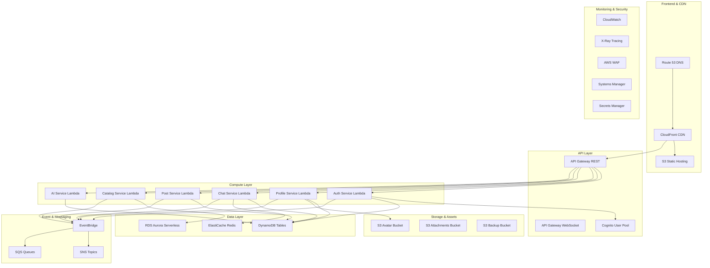
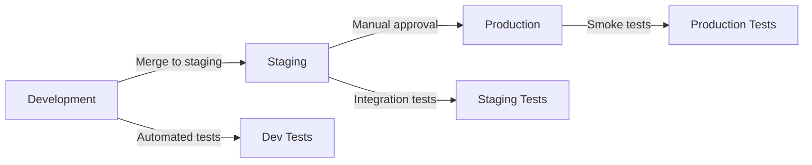

# 🏗️ Infrastructure Documentation

> **Purpose**: Complete infrastructure setup using Infrastructure as Code (IaC) with Serverless Framework, SST, and Terraform. This guide covers deployment, scaling, and management of AWS resources.

## 📋 Table of Contents

- [🎯 Infrastructure Overview](#-infrastructure-overview)
- [🛠️ Deployment Options](#️-deployment-options)
- [📦 Serverless Framework Setup](#-serverless-framework-setup)
- [🚀 SST Configuration](#-sst-configuration)
- [🔧 Terraform Alternative](#-terraform-alternative)
- [🌍 Environment Management](#-environment-management)
- [📊 Monitoring & Observability](#-monitoring--observability)
- [🔒 Security Configuration](#-security-configuration)
- [💰 Cost Optimization](#-cost-optimization)

---

## 🎯 Infrastructure Overview

Our multitask platform uses a serverless-first approach with the following AWS services:



### Resource Naming Convention
```yaml
# Naming pattern: {service}-{resource}-{environment}
# Examples:
# - auth-lambda-prod
# - chat-messages-table-dev
# - profile-avatars-bucket-staging
```

---

## 🛠️ Deployment Options

We support three Infrastructure as Code (IaC) approaches:

| Tool | Best For | Pros | Cons |
|------|----------|------|------|
| **Serverless Framework** | Simple serverless apps | Easy to start, good Lambda support | Limited non-serverless resources |
| **SST (Serverless Stack)** | Modern full-stack apps | Type-safe, great DX, CDK-based | Newer tool, smaller community |
| **Terraform** | Complex multi-cloud | Mature, supports everything | Steeper learning curve |

### Recommended Approach

For this project, we recommend **SST** for new deployments and **Serverless Framework** for simpler setups.

---

## 📦 Serverless Framework Setup

### Project Structure
```
infra/
├── serverless.yml              # Main configuration
├── resources/                  # CloudFormation resources
│   ├── dynamodb-tables.yml
│   ├── s3-buckets.yml
│   ├── cognito.yml
│   └── iam-roles.yml
├── environments/               # Environment-specific configs
│   ├── dev.yml
│   ├── staging.yml
│   └── prod.yml
└── plugins/                    # Custom plugins
    └── deployment-notifications.js
```

### Main Configuration (serverless.yml)
```yaml
service: multitask-platform

frameworkVersion: '3'

provider:
  name: aws
  runtime: go1.x
  region: ${env:AWS_REGION, 'us-east-1'}
  stage: ${opt:stage, 'dev'}
  environment:
    STAGE: ${self:provider.stage}
    REGION: ${self:provider.region}
  
  # Global IAM permissions
  iam:
    role:
      statements:
        - Effect: Allow
          Action:
            - dynamodb:Query
            - dynamodb:Scan
            - dynamodb:GetItem
            - dynamodb:PutItem
            - dynamodb:UpdateItem
            - dynamodb:DeleteItem
          Resource:
            - !GetAtt AuthSessionsTable.Arn
            - !GetAtt ProfilesTable.Arn
            - !GetAtt ChatMessagesTable.Arn
            - !GetAtt ChatRoomsTable.Arn
            - !GetAtt PostsTable.Arn
        - Effect: Allow
          Action:
            - s3:GetObject
            - s3:PutObject
            - s3:DeleteObject
          Resource:
            - !Sub "${AvatarsBucket}/*"
            - !Sub "${AttachmentsBucket}/*"
        - Effect: Allow
          Action:
            - events:PutEvents
          Resource:
            - !GetAtt EventBridge.Arn

# Individual service functions
functions:
  # Authentication Service
  auth:
    handler: bin/auth
    package:
      include:
        - bin/auth
    events:
      - http:
          path: /v1/auth/{proxy+}
          method: ANY
          cors: true
    environment:
      COGNITO_USER_POOL_ID: !Ref CognitoUserPool
      COGNITO_CLIENT_ID: !Ref CognitoUserPoolClient
      DYNAMODB_TABLE_SESSIONS: !Ref AuthSessionsTable
      JWT_SECRET: ${ssm:/multitask/${self:provider.stage}/jwt-secret}
  
  # Profile Service
  profile:
    handler: bin/profile
    package:
      include:
        - bin/profile
    events:
      - http:
          path: /v1/profile/{proxy+}
          method: ANY
          cors: true
    environment:
      DYNAMODB_TABLE_PROFILES: !Ref ProfilesTable
      S3_BUCKET_AVATARS: !Ref AvatarsBucket
      CLOUDFRONT_DOMAIN: !GetAtt AvatarsCloudFront.DomainName
  
  # Chat Service
  chat:
    handler: bin/chat
    package:
      include:
        - bin/chat
    events:
      - http:
          path: /v1/chat/{proxy+}
          method: ANY
          cors: true
      - websocket:
          route: $connect
      - websocket:
          route: $disconnect
      - websocket:
          route: join_room
      - websocket:
          route: send_message
    environment:
      DYNAMODB_TABLE_MESSAGES: !Ref ChatMessagesTable
      DYNAMODB_TABLE_ROOMS: !Ref ChatRoomsTable
      ELASTICACHE_CLUSTER: ${self:custom.elasticacheClusterEndpoint}
      WEBSOCKET_API_ENDPOINT: !Sub "${WebsocketsApi}.execute-api.${AWS::Region}.amazonaws.com/${self:provider.stage}"
  
  # Post Service
  post:
    handler: bin/post
    package:
      include:
        - bin/post
    events:
      - http:
          path: /v1/posts/{proxy+}
          method: ANY
          cors: true
    environment:
      DYNAMODB_TABLE_POSTS: !Ref PostsTable
      DYNAMODB_TABLE_COMMENTS: !Ref CommentsTable
  
  # Catalog Service
  catalog:
    handler: bin/catalog
    package:
      include:
        - bin/catalog
    events:
      - http:
          path: /v1/catalog/{proxy+}
          method: ANY
          cors: true
    environment:
      RDS_ENDPOINT: !GetAtt CatalogRDSCluster.Endpoint.Address
      RDS_DATABASE: ${self:custom.rdsDatabase}
      RDS_USERNAME: ${ssm:/multitask/${self:provider.stage}/rds-username}
      RDS_PASSWORD: ${ssm:/multitask/${self:provider.stage}/rds-password~true}
  
  # AI Service
  ai:
    handler: bin/ai
    timeout: 30
    package:
      include:
        - bin/ai
    events:
      - http:
          path: /v1/ai/{proxy+}
          method: ANY
          cors: true
    environment:
      GEMINI_API_KEY: ${ssm:/multitask/${self:provider.stage}/gemini-api-key~true}
      OPENAI_API_KEY: ${ssm:/multitask/${self:provider.stage}/openai-api-key~true}

# Custom variables
custom:
  stage: ${self:provider.stage}
  elasticacheClusterEndpoint: !GetAtt ElastiCacheCluster.RedisEndpoint.Address
  rdsDatabase: multitask_${self:provider.stage}
  
  # Serverless plugins configuration
  webpack:
    webpackConfig: webpack.config.js
    includeModules: true
  
  customDomain:
    domainName: 
      dev: api-dev.multitask.com
      staging: api-staging.multitask.com
      prod: api.multitask.com
    certificateName: '*.multitask.com'
    createRoute53Record: true

# Plugins
plugins:
  - serverless-webpack
  - serverless-domain-manager
  - serverless-offline
  - serverless-prune-plugin

# CloudFormation resources
resources:
  # Include separate resource files
  - ${file(resources/cognito.yml)}
  - ${file(resources/dynamodb-tables.yml)}
  - ${file(resources/s3-buckets.yml)}
  - ${file(resources/elasticache.yml)}
  - ${file(resources/rds.yml)}
  - ${file(resources/eventbridge.yml)}
  - ${file(resources/monitoring.yml)}
```

### DynamoDB Tables Resource (resources/dynamodb-tables.yml)
```yaml
Resources:
  # Auth service tables
  AuthSessionsTable:
    Type: AWS::DynamoDB::Table
    Properties:
      TableName: auth-sessions-${self:provider.stage}
      BillingMode: PAY_PER_REQUEST
      AttributeDefinitions:
        - AttributeName: session_id
          AttributeType: S
        - AttributeName: user_id
          AttributeType: S
      KeySchema:
        - AttributeName: session_id
          KeyType: HASH
      GlobalSecondaryIndexes:
        - IndexName: user-id-index
          KeySchema:
            - AttributeName: user_id
              KeyType: HASH
          Projection:
            ProjectionType: ALL
      TimeToLiveSpecification:
        AttributeName: expires_at
        Enabled: true
      StreamSpecification:
        StreamViewType: NEW_AND_OLD_IMAGES
      PointInTimeRecoverySpecification:
        PointInTimeRecoveryEnabled: true

  # Profile service tables
  ProfilesTable:
    Type: AWS::DynamoDB::Table
    Properties:
      TableName: profile-profiles-${self:provider.stage}
      BillingMode: PAY_PER_REQUEST
      AttributeDefinitions:
        - AttributeName: user_id
          AttributeType: S
      KeySchema:
        - AttributeName: user_id
          KeyType: HASH
      StreamSpecification:
        StreamViewType: NEW_AND_OLD_IMAGES
      PointInTimeRecoverySpecification:
        PointInTimeRecoveryEnabled: true

  # Chat service tables
  ChatMessagesTable:
    Type: AWS::DynamoDB::Table
    Properties:
      TableName: chat-messages-${self:provider.stage}
      BillingMode: PAY_PER_REQUEST
      AttributeDefinitions:
        - AttributeName: message_id
          AttributeType: S
        - AttributeName: room_id
          AttributeType: S
        - AttributeName: timestamp
          AttributeType: S
      KeySchema:
        - AttributeName: message_id
          KeyType: HASH
      GlobalSecondaryIndexes:
        - IndexName: room-messages-index
          KeySchema:
            - AttributeName: room_id
              KeyType: HASH
            - AttributeName: timestamp
              KeyType: RANGE
          Projection:
            ProjectionType: ALL
      StreamSpecification:
        StreamViewType: NEW_AND_OLD_IMAGES

  ChatRoomsTable:
    Type: AWS::DynamoDB::Table
    Properties:
      TableName: chat-rooms-${self:provider.stage}
      BillingMode: PAY_PER_REQUEST
      AttributeDefinitions:
        - AttributeName: room_id
          AttributeType: S
        - AttributeName: type
          AttributeType: S
      KeySchema:
        - AttributeName: room_id
          KeyType: HASH
      GlobalSecondaryIndexes:
        - IndexName: room-type-index
          KeySchema:
            - AttributeName: type
              KeyType: HASH
          Projection:
            ProjectionType: ALL

  # Post service tables
  PostsTable:
    Type: AWS::DynamoDB::Table
    Properties:
      TableName: post-posts-${self:provider.stage}
      BillingMode: PAY_PER_REQUEST
      AttributeDefinitions:
        - AttributeName: post_id
          AttributeType: S
        - AttributeName: created_at
          AttributeType: S
        - AttributeName: author_id
          AttributeType: S
      KeySchema:
        - AttributeName: post_id
          KeyType: HASH
      GlobalSecondaryIndexes:
        - IndexName: timeline-index
          KeySchema:
            - AttributeName: created_at
              KeyType: HASH
          Projection:
            ProjectionType: ALL
        - IndexName: author-posts-index
          KeySchema:
            - AttributeName: author_id
              KeyType: HASH
            - AttributeName: created_at
              KeyType: RANGE
          Projection:
            ProjectionType: ALL

  CommentsTable:
    Type: AWS::DynamoDB::Table
    Properties:
      TableName: post-comments-${self:provider.stage}
      BillingMode: PAY_PER_REQUEST
      AttributeDefinitions:
        - AttributeName: comment_id
          AttributeType: S
        - AttributeName: post_id
          AttributeType: S
        - AttributeName: created_at
          AttributeType: S
      KeySchema:
        - AttributeName: comment_id
          KeyType: HASH
      GlobalSecondaryIndexes:
        - IndexName: post-comments-index
          KeySchema:
            - AttributeName: post_id
              KeyType: HASH
            - AttributeName: created_at
              KeyType: RANGE
          Projection:
            ProjectionType: ALL
```

### Deployment Commands
```bash
# Install Serverless Framework
npm install -g serverless

# Install project dependencies
npm install

# Deploy to development
serverless deploy --stage dev

# Deploy to production
serverless deploy --stage prod

# Deploy specific function
serverless deploy function --function auth --stage prod

# Remove deployment
serverless remove --stage dev
```

---

## 🚀 SST Configuration

SST (Serverless Stack) provides a modern, type-safe approach to building serverless applications.

### Project Structure
```
infra/
├── sst.config.ts               # Main SST configuration
├── stacks/                     # Individual stack definitions
│   ├── AuthStack.ts
│   ├── ProfileStack.ts
│   ├── ChatStack.ts
│   ├── PostStack.ts
│   ├── CatalogStack.ts
│   ├── AIStack.ts
│   ├── DatabaseStack.ts
│   ├── StorageStack.ts
│   └── MonitoringStack.ts
└── lib/                        # Shared utilities
    ├── constants.ts
    └── utils.ts
```

### Main Configuration (sst.config.ts)
```typescript
import { SSTConfig } from "sst";
import { AuthStack } from "./stacks/AuthStack";
import { ProfileStack } from "./stacks/ProfileStack";
import { ChatStack } from "./stacks/ChatStack";
import { PostStack } from "./stacks/PostStack";
import { CatalogStack } from "./stacks/CatalogStack";
import { AIStack } from "./stacks/AIStack";
import { DatabaseStack } from "./stacks/DatabaseStack";
import { StorageStack } from "./stacks/StorageStack";
import { MonitoringStack } from "./stacks/MonitoringStack";

export default {
  config(_input) {
    return {
      name: "multitask-platform",
      region: process.env.AWS_REGION || "us-east-1",
    };
  },
  
  stacks(app) {
    // Remove all stacks when app is deleted
    app.setDefaultRemovalPolicy("destroy");
    
    // Set default function properties
    app.setDefaultFunctionProps({
      runtime: "go1.x",
      timeout: "30 seconds",
      memorySize: "512 MB",
      tracing: "active", // Enable X-Ray tracing
      environment: {
        STAGE: app.stage,
        REGION: app.region,
      },
    });

    // Core infrastructure stacks
    const database = app.stack(DatabaseStack);
    const storage = app.stack(StorageStack);
    
    // Service stacks (depend on core infrastructure)
    const auth = app.stack(AuthStack, { database, storage });
    const profile = app.stack(ProfileStack, { database, storage });
    const chat = app.stack(ChatStack, { database, storage });
    const post = app.stack(PostStack, { database, storage });
    const catalog = app.stack(CatalogStack, { database, storage });
    const ai = app.stack(AIStack, { database, storage });
    
    // Monitoring stack (depends on all services)
    app.stack(MonitoringStack, {
      services: { auth, profile, chat, post, catalog, ai }
    });
  },
} satisfies SSTConfig;
```

### Database Stack (stacks/DatabaseStack.ts)
```typescript
import { StackContext, Table } from "sst/constructs";

export function DatabaseStack({ stack }: StackContext) {
  // Auth service tables
  const authSessions = new Table(stack, "AuthSessions", {
    fields: {
      session_id: "string",
      user_id: "string",
      expires_at: "number",
    },
    primaryIndex: { partitionKey: "session_id" },
    globalIndexes: {
      "user-id-index": { partitionKey: "user_id" },
    },
    timeToLiveAttribute: "expires_at",
    stream: "new_and_old_images",
    pointInTimeRecovery: true,
  });

  // Profile service tables
  const profiles = new Table(stack, "Profiles", {
    fields: {
      user_id: "string",
    },
    primaryIndex: { partitionKey: "user_id" },
    stream: "new_and_old_images",
    pointInTimeRecovery: true,
  });

  // Chat service tables
  const chatMessages = new Table(stack, "ChatMessages", {
    fields: {
      message_id: "string",
      room_id: "string",
      timestamp: "string",
    },
    primaryIndex: { partitionKey: "message_id" },
    globalIndexes: {
      "room-messages-index": {
        partitionKey: "room_id",
        sortKey: "timestamp",
      },
    },
    stream: "new_and_old_images",
  });

  const chatRooms = new Table(stack, "ChatRooms", {
    fields: {
      room_id: "string",
      type: "string",
    },
    primaryIndex: { partitionKey: "room_id" },
    globalIndexes: {
      "room-type-index": { partitionKey: "type" },
    },
  });

  // Post service tables
  const posts = new Table(stack, "Posts", {
    fields: {
      post_id: "string",
      created_at: "string",
      author_id: "string",
    },
    primaryIndex: { partitionKey: "post_id" },
    globalIndexes: {
      "timeline-index": { partitionKey: "created_at" },
      "author-posts-index": {
        partitionKey: "author_id",
        sortKey: "created_at",
      },
    },
  });

  const comments = new Table(stack, "Comments", {
    fields: {
      comment_id: "string",
      post_id: "string",
      created_at: "string",
    },
    primaryIndex: { partitionKey: "comment_id" },
    globalIndexes: {
      "post-comments-index": {
        partitionKey: "post_id",
        sortKey: "created_at",
      },
    },
  });

  return {
    authSessions,
    profiles,
    chatMessages,
    chatRooms,
    posts,
    comments,
  };
}
```

### Auth Stack (stacks/AuthStack.ts)
```typescript
import { StackContext, Function, Api, Cognito } from "sst/constructs";
import type { DatabaseStack } from "./DatabaseStack";
import type { StorageStack } from "./StorageStack";

interface AuthStackProps {
  database: ReturnType<typeof DatabaseStack>;
  storage: ReturnType<typeof StorageStack>;
}

export function AuthStack({ stack, database, storage }: StackContext & AuthStackProps) {
  // Cognito User Pool
  const userPool = new Cognito(stack, "UserPool", {
    login: ["email"],
    cdk: {
      userPool: {
        passwordPolicy: {
          minLength: 8,
          requireLowercase: true,
          requireUppercase: true,
          requireDigits: true,
          requireSymbols: true,
        },
        accountRecovery: "email_only",
        selfSignUpEnabled: true,
        userVerification: {
          emailSubject: "Verify your email for Multitask Platform",
          emailBody: "Your verification code is {####}",
        },
      },
    },
  });

  // Auth service Lambda function
  const authFunction = new Function(stack, "AuthFunction", {
    handler: "cmd/lambda/main.go",
    environment: {
      COGNITO_USER_POOL_ID: userPool.userPoolId,
      COGNITO_CLIENT_ID: userPool.userPoolClientId,
      DYNAMODB_TABLE_SESSIONS: database.authSessions.tableName,
      JWT_SECRET: process.env.JWT_SECRET!,
    },
    permissions: [
      database.authSessions,
      userPool,
      "ssm:GetParameter",
      "ssm:GetParameters",
    ],
  });

  // API Gateway for auth endpoints
  const api = new Api(stack, "AuthApi", {
    routes: {
      "ANY /v1/auth/{proxy+}": authFunction,
    },
    cors: {
      allowMethods: ["ANY"],
      allowOrigins: ["*"],
      allowHeaders: ["*"],
    },
  });

  return {
    userPool,
    authFunction,
    api,
  };
}
```

### Deployment Commands
```bash
# Install SST
npm install -g sst

# Install dependencies
npm install

# Start development mode (with live reloading)
sst dev

# Deploy to staging
sst deploy --stage staging

# Deploy to production
sst deploy --stage prod

# Remove deployment
sst remove --stage dev
```

---

## 🔧 Terraform Alternative

For teams preferring Terraform, here's a basic setup:

### Project Structure
```
infra/terraform/
├── main.tf                     # Main configuration
├── variables.tf                # Input variables
├── outputs.tf                  # Output values
├── versions.tf                 # Provider versions
├── modules/                    # Reusable modules
│   ├── auth-service/
│   ├── profile-service/
│   ├── chat-service/
│   ├── post-service/
│   ├── catalog-service/
│   └── ai-service/
└── environments/               # Environment-specific configs
    ├── dev.tfvars
    ├── staging.tfvars
    └── prod.tfvars
```

### Main Configuration (main.tf)
```hcl
terraform {
  required_version = ">= 1.0"
  
  backend "s3" {
    bucket = "multitask-terraform-state"
    key    = "multitask-platform/terraform.tfstate"
    region = "us-east-1"
  }
  
  required_providers {
    aws = {
      source  = "hashicorp/aws"
      version = "~> 5.0"
    }
  }
}

provider "aws" {
  region = var.aws_region
  
  default_tags {
    tags = {
      Project     = "multitask-platform"
      Environment = var.environment
      ManagedBy   = "terraform"
    }
  }
}

# Data sources
data "aws_caller_identity" "current" {}
data "aws_region" "current" {}

# Local values
locals {
  common_tags = {
    Project     = "multitask-platform"
    Environment = var.environment
    ManagedBy   = "terraform"
  }
  
  name_prefix = "multitask-${var.environment}"
}

# Core infrastructure modules
module "networking" {
  source = "./modules/networking"
  
  name_prefix = local.name_prefix
  tags        = local.common_tags
}

module "security" {
  source = "./modules/security"
  
  name_prefix = local.name_prefix
  tags        = local.common_tags
}

module "database" {
  source = "./modules/database"
  
  name_prefix = local.name_prefix
  vpc_id      = module.networking.vpc_id
  subnet_ids  = module.networking.private_subnet_ids
  tags        = local.common_tags
}

module "storage" {
  source = "./modules/storage"
  
  name_prefix = local.name_prefix
  tags        = local.common_tags
}

# Service modules
module "auth_service" {
  source = "./modules/auth-service"
  
  name_prefix           = local.name_prefix
  dynamodb_tables       = module.database.dynamodb_tables
  cognito_user_pool_id  = module.security.cognito_user_pool_id
  api_gateway_id        = module.networking.api_gateway_id
  tags                  = local.common_tags
}

module "profile_service" {
  source = "./modules/profile-service"
  
  name_prefix           = local.name_prefix
  dynamodb_tables       = module.database.dynamodb_tables
  s3_buckets           = module.storage.s3_buckets
  api_gateway_id        = module.networking.api_gateway_id
  tags                  = local.common_tags
}

# ... other service modules
```

### Deployment Commands
```bash
# Initialize Terraform
terraform init

# Plan deployment
terraform plan -var-file="environments/dev.tfvars"

# Apply changes
terraform apply -var-file="environments/prod.tfvars"

# Destroy infrastructure
terraform destroy -var-file="environments/dev.tfvars"
```

---

## 🌍 Environment Management

### Environment Strategy
- **Development**: `dev` - Personal development, frequent deployments
- **Staging**: `staging` - Pre-production testing, stable features
- **Production**: `prod` - Live environment, careful deployments

### Environment-Specific Configurations

#### Development (environments/dev.yml)
```yaml
# Development environment settings
provider:
  environment:
    LOG_LEVEL: debug
    CORS_ORIGINS: "*"
    RATE_LIMIT_ENABLED: false

custom:
  domains:
    api: api-dev.multitask.com
    websocket: ws-dev.multitask.com
    cdn: cdn-dev.multitask.com
  
  scaling:
    lambda:
      reservedConcurrency: 5
      provisionedConcurrency: 0
    
    dynamodb:
      billingMode: PAY_PER_REQUEST
    
    rds:
      instanceClass: db.t3.micro
      minCapacity: 0.5
      maxCapacity: 1
  
  monitoring:
    enableDetailedMonitoring: false
    logRetentionDays: 7
```

#### Production (environments/prod.yml)
```yaml
# Production environment settings
provider:
  environment:
    LOG_LEVEL: info
    CORS_ORIGINS: "https://multitask.com,https://www.multitask.com"
    RATE_LIMIT_ENABLED: true

custom:
  domains:
    api: api.multitask.com
    websocket: ws.multitask.com
    cdn: cdn.multitask.com
  
  scaling:
    lambda:
      reservedConcurrency: 100
      provisionedConcurrency: 10
    
    dynamodb:
      billingMode: PAY_PER_REQUEST
      pointInTimeRecovery: true
    
    rds:
      instanceClass: db.r5.large
      minCapacity: 2
      maxCapacity: 16
      multiAZ: true
  
  monitoring:
    enableDetailedMonitoring: true
    logRetentionDays: 365
    enableXRayTracing: true
```

### Environment Promotion Pipeline


---

## 📊 Monitoring & Observability

### CloudWatch Dashboard Configuration
```yaml
# Monitoring stack
MonitoringStack:
  Resources:
    # Main dashboard
    MainDashboard:
      Type: AWS::CloudWatch::Dashboard
      Properties:
        DashboardName: multitask-platform-${self:provider.stage}
        DashboardBody: !Sub |
          {
            "widgets": [
              {
                "type": "metric",
                "x": 0, "y": 0, "width": 12, "height": 6,
                "properties": {
                  "metrics": [
                    ["AWS/Lambda", "Invocations", "FunctionName", "${AuthFunction}"],
                    ["AWS/Lambda", "Errors", "FunctionName", "${AuthFunction}"],
                    ["AWS/Lambda", "Duration", "FunctionName", "${AuthFunction}"]
                  ],
                  "period": 300,
                  "stat": "Sum",
                  "region": "${AWS::Region}",
                  "title": "Auth Service Metrics"
                }
              },
              {
                "type": "metric",
                "x": 12, "y": 0, "width": 12, "height": 6,
                "properties": {
                  "metrics": [
                    ["AWS/DynamoDB", "ConsumedReadCapacityUnits", "TableName", "${AuthSessionsTable}"],
                    ["AWS/DynamoDB", "ConsumedWriteCapacityUnits", "TableName", "${AuthSessionsTable}"]
                  ],
                  "period": 300,
                  "stat": "Sum",
                  "region": "${AWS::Region}",
                  "title": "DynamoDB Metrics"
                }
              }
            ]
          }

    # CloudWatch Alarms
    HighErrorRateAlarm:
      Type: AWS::CloudWatch::Alarm
      Properties:
        AlarmName: multitask-high-error-rate-${self:provider.stage}
        AlarmDescription: High error rate detected
        MetricName: Errors
        Namespace: AWS/Lambda
        Statistic: Sum
        Period: 300
        EvaluationPeriods: 2
        Threshold: 10
        ComparisonOperator: GreaterThanThreshold
        AlarmActions:
          - !Ref AlertsTopic

    # SNS topic for alerts
    AlertsTopic:
      Type: AWS::SNS::Topic
      Properties:
        TopicName: multitask-alerts-${self:provider.stage}
        Subscription:
          - Protocol: email
            Endpoint: ${env:ALERT_EMAIL, 'alerts@multitask.com'}
```

### X-Ray Tracing Configuration
```yaml
# Enable X-Ray tracing for all functions
provider:
  tracing:
    lambda: true
    apiGateway: true

# X-Ray service map segments
custom:
  tracing:
    segments:
      - name: auth-service
        service: auth
      - name: profile-service
        service: profile
      - name: chat-service
        service: chat
```

---

## 🔒 Security Configuration

### IAM Roles and Policies
```yaml
# IAM roles for Lambda functions
IamRoleLambdaExecution:
  Type: AWS::IAM::Role
  Properties:
    RoleName: multitask-lambda-role-${self:provider.stage}
    AssumeRolePolicyDocument:
      Version: '2012-10-17'
      Statement:
        - Effect: Allow
          Principal:
            Service:
              - lambda.amazonaws.com
          Action: sts:AssumeRole
    ManagedPolicyArns:
      - arn:aws:iam::aws:policy/service-role/AWSLambdaBasicExecutionRole
      - arn:aws:iam::aws:policy/AWSXRayDaemonWriteAccess
    Policies:
      - PolicyName: DynamoDBAccess
        PolicyDocument:
          Version: '2012-10-17'
          Statement:
            - Effect: Allow
              Action:
                - dynamodb:Query
                - dynamodb:Scan
                - dynamodb:GetItem
                - dynamodb:PutItem
                - dynamodb:UpdateItem
                - dynamodb:DeleteItem
              Resource:
                - !GetAtt AuthSessionsTable.Arn
                - !GetAtt ProfilesTable.Arn
                - !Sub "${AuthSessionsTable.Arn}/index/*"
      - PolicyName: S3Access
        PolicyDocument:
          Version: '2012-10-17'
          Statement:
            - Effect: Allow
              Action:
                - s3:GetObject
                - s3:PutObject
                - s3:DeleteObject
              Resource:
                - !Sub "${AvatarsBucket}/*"
                - !Sub "${AttachmentsBucket}/*"
```

### Security Groups and VPC Configuration
```yaml
# VPC Configuration for RDS and ElastiCache
VPC:
  Type: AWS::EC2::VPC
  Properties:
    CidrBlock: 10.0.0.0/16
    EnableDnsHostnames: true
    EnableDnsSupport: true

# Security group for Lambda functions
LambdaSecurityGroup:
  Type: AWS::EC2::SecurityGroup
  Properties:
    GroupDescription: Security group for Lambda functions
    VpcId: !Ref VPC
    SecurityGroupEgress:
      - IpProtocol: -1
        CidrIp: 0.0.0.0/0

# Security group for RDS
DatabaseSecurityGroup:
  Type: AWS::EC2::SecurityGroup
  Properties:
    GroupDescription: Security group for RDS database
    VpcId: !Ref VPC
    SecurityGroupIngress:
      - IpProtocol: tcp
        FromPort: 5432
        ToPort: 5432
        SourceSecurityGroupId: !Ref LambdaSecurityGroup
```

### AWS WAF Configuration
```yaml
# WAF for API protection
WebACL:
  Type: AWS::WAFv2::WebACL
  Properties:
    Name: multitask-waf-${self:provider.stage}
    Scope: REGIONAL
    DefaultAction:
      Allow: {}
    Rules:
      - Name: RateLimitRule
        Priority: 1
        Statement:
          RateBasedStatement:
            Limit: 1000
            AggregateKeyType: IP
        Action:
          Block: {}
        VisibilityConfig:
          SampledRequestsEnabled: true
          CloudWatchMetricsEnabled: true
          MetricName: RateLimitRule
      - Name: AWSManagedRulesCommonRuleSet
        Priority: 2
        OverrideAction:
          None: {}
        Statement:
          ManagedRuleGroupStatement:
            VendorName: AWS
            Name: AWSManagedRulesCommonRuleSet
        VisibilityConfig:
          SampledRequestsEnabled: true
          CloudWatchMetricsEnabled: true
          MetricName: CommonRuleSetMetric
```

---

## 💰 Cost Optimization

### Cost Management Strategies

#### 1. Right-Sizing Resources
```yaml
# Cost-optimized Lambda configuration
functions:
  auth:
    memorySize: 512  # Start small, monitor, and adjust
    timeout: 10      # Keep timeouts reasonable
    reservedConcurrency: 20  # Prevent runaway costs
    
  chat:
    memorySize: 1024  # Higher memory for WebSocket handling
    timeout: 30
    provisionedConcurrency: 5  # Only for high-traffic functions
```

#### 2. DynamoDB Cost Optimization
```yaml
# DynamoDB billing modes by environment
custom:
  dynamodbBillingMode:
    dev: PAY_PER_REQUEST      # Better for low/unpredictable traffic
    staging: PAY_PER_REQUEST
    prod: PROVISIONED         # Better for consistent high traffic
  
  dynamodbCapacity:
    prod:
      readCapacity: 5
      writeCapacity: 5
      autoScaling:
        read:
          min: 5
          max: 100
          targetUtilization: 70
        write:
          min: 5
          max: 100
          targetUtilization: 70
```

#### 3. S3 Storage Classes and Lifecycle
```yaml
# S3 lifecycle configuration for cost optimization
AvatarsBucket:
  Type: AWS::S3::Bucket
  Properties:
    LifecycleConfiguration:
      Rules:
        - Id: TransitionToIA
          Status: Enabled
          Transition:
            Days: 30
            StorageClass: STANDARD_IA
        - Id: TransitionToGlacier
          Status: Enabled
          Transition:
            Days: 90
            StorageClass: GLACIER
        - Id: DeleteOldObjects
          Status: Enabled
          ExpirationInDays: 2555  # 7 years
```

#### 4. CloudWatch Logs Retention
```yaml
# Log retention policies
custom:
  logRetentionInDays:
    dev: 7        # Short retention for development
    staging: 30   # Medium retention for staging
    prod: 365     # Long retention for production
```

### Cost Monitoring Dashboard
```json
{
  "widgets": [
    {
      "type": "metric",
      "properties": {
        "metrics": [
          ["AWS/Billing", "EstimatedCharges", "Currency", "USD"]
        ],
        "period": 86400,
        "stat": "Maximum",
        "region": "us-east-1",
        "title": "Estimated Monthly Charges"
      }
    }
  ]
}
```

### Budget Alerts
```yaml
CostBudget:
  Type: AWS::Budgets::Budget
  Properties:
    Budget:
      BudgetName: multitask-platform-${self:provider.stage}
      BudgetLimit:
        Amount: 100
        Unit: USD
      TimeUnit: MONTHLY
      BudgetType: COST
      CostFilters:
        TagKey:
          - Project
        TagValue:
          - multitask-platform
    NotificationsWithSubscribers:
      - Notification:
          NotificationType: ACTUAL
          ComparisonOperator: GREATER_THAN
          Threshold: 80
        Subscribers:
          - SubscriptionType: EMAIL
            Address: billing@multitask.com
```

---

## 🚀 Deployment Best Practices

### 1. Blue-Green Deployment Strategy
```yaml
# Lambda alias configuration for blue-green deployment
functions:
  auth:
    handler: bin/auth
    # Use weighted aliases for gradual rollout
    events:
      - http:
          path: /v1/auth/{proxy+}
          method: ANY
          # Route 90% to current, 10% to new version
          integration: lambda
          request:
            parameters:
              headers:
                x-lambda-alias: production:10,staging:90
```

### 2. Rollback Strategy
```bash
#!/bin/bash
# rollback.sh - Quick rollback script

STAGE=${1:-prod}
PREVIOUS_VERSION=${2}

if [ -z "$PREVIOUS_VERSION" ]; then
  echo "Getting previous version..."
  PREVIOUS_VERSION=$(aws lambda list-versions-by-function \
    --function-name multitask-auth-$STAGE \
    --query 'Versions[-2].Version' \
    --output text)
fi

echo "Rolling back to version: $PREVIOUS_VERSION"

# Update alias to point to previous version
aws lambda update-alias \
  --function-name multitask-auth-$STAGE \
  --name production \
  --function-version $PREVIOUS_VERSION

echo "Rollback completed"
```

### 3. Database Migration Strategy
```yaml
# Database migration Lambda
migration:
  handler: bin/migration
  timeout: 300  # 5 minutes for migrations
  events:
    - schedule:
        rate: rate(1 day)  # Run daily to check for pending migrations
        enabled: false     # Enable only when needed
  environment:
    MIGRATION_STATE_TABLE: !Ref MigrationStateTable
```

### 4. Health Checks and Readiness Probes
```yaml
# Health check endpoints
functions:
  healthCheck:
    handler: bin/health
    events:
      - http:
          path: /health
          method: GET
          cors: true
    environment:
      DYNAMODB_TABLES: !Join [',', [!Ref AuthSessionsTable, !Ref ProfilesTable]]
      RDS_ENDPOINT: !GetAtt CatalogRDSCluster.Endpoint.Address
```

---

**Next**: [🤖 CI/CD Pipeline Documentation](../.github/workflows/README.md)

---

## 📞 Support

- **Issues**: [GitHub Issues](https://github.com/your-username/MultitaskProject/issues)
- **Documentation**: [Main README](../README.md)
- **Infrastructure Questions**: [Discussions](https://github.com/your-username/MultitaskProject/discussions)